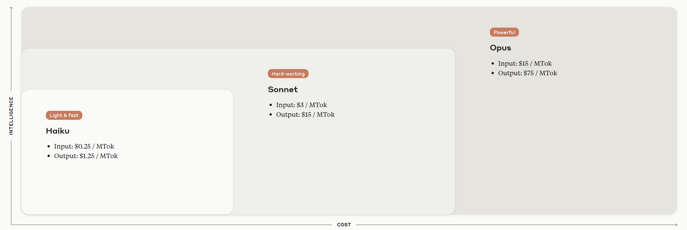

# Test-Driven Development Meets AI

1. [The Story Writing Agent](./tdd_story_writing.md)
2. [The Unit Testing Agent](./tdd_unit_testing.md)
3. [The Implementation Agent](./tdd_implementation.md)
4. [The Code Refactoring Agent](./tdd_refactoring.md)

# The Benefits of This Approach

### 1. Knowing the Expected Outcome Beforehand

Generative AI models excel at producing creative results. However, this can be a weakness when working in domains that require a high degree of precision, such as writing code.

Test-Driven Development helps address this by requiring the AI to generate an output that meets the expected outcome. The work is not considered complete until all the tests have passed.

### 2. Reduced Costs

When interacting with large language models (LLMs), we often engage in lengthy conversations. The more tokens that are exchanged in each request, the higher the overall cost.

This flow takes a different approach. Typically, each conversation involves a single prompt and response. The generated output is then applied to the current source code, the tests are run, and the results are used to start the next cycle.

Additionally, defining a laser-focused role for each agent helps the LLM identify the most relevant dataset to draw from. This not only improves the accuracy of the responses, but also allows the use of more lightweight models, like Claude Haiku, which can reduce costs by at least 12 times compared to larger models (based on the Claude pricing table).

